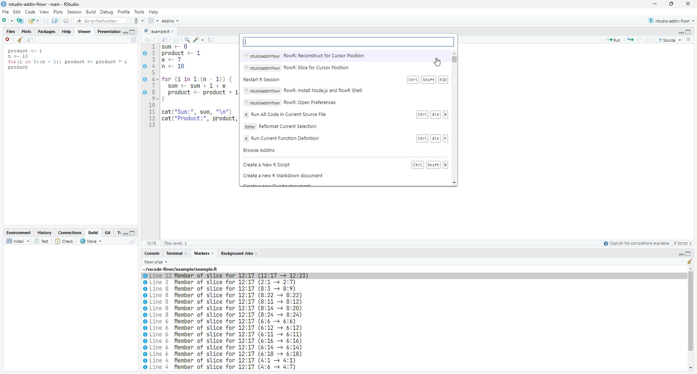

# rstudio-addin-flowr

RStudio addin for [*flowR*](https://github.com/Code-Inspect/flowr)



## Installing
This package is currently only available here on GitHub, but it can be installed easily using the `remotes` package by running the following commands. Please keep in mind that you need `remotes` version 2.5.0 or newer for this to work.
```R
install.packages("remotes")
remotes::install_github("flowr-analysis/rstudio-addin-flowr")
```

In the future, we plan on making the package available on CRAN as well.

## Usage

After installing the package, you can start RStudio and run any of the addins provided by this package through the command palette (they all start with the name *flowR*), or through the Addins menu.

For more info on using addins, see [the RStudio User Guide](https://docs.posit.co/ide/user/ide/guide/productivity/add-ins.html).

### Preferences

Open the *flowR* preferences (the "Open Preferences" addin) to choose the
**engine** and flowR version, and the syntax-highlighting themes for the
reconstruction view.

### Engines

All flowR handling lives in the [`flowr`](https://github.com/flowr-analysis/flowr-r-adapter)
package; this addin is a thin UI on top of it. The engine options are:

* `bundled` - flowR's JS + wasm shipped inside the `flowr` package; runs on your
  Node.js, no download.
* `binary` - a self-contained native flowR executable (no Node), downloaded once
  and checksum/signature-verified.
* `node` / `docker` - the flowR npm package or Docker image.
* `auto` (default) - a cached binary, else the bundle, else the binary.

The engine starts automatically the first time an addin needs it. To fetch the
native binary up front, run the "Install Node.js and flowR Shell" addin (it calls
`flowr::flowr_install()`).

### Slicing

You can generate a [slice](https://github.com/flowr-analysis/flowr/wiki/Terminology#program-slice) of the currently highlighted variable in any R code by using the "Slice for Cursor Position" addin. All code that is part of the generated slice will then be highlighted with a blue symbol in the gutter.

When using the "Reconstruct for Cursor Position" addin, the slice's reconstructed code is also shown in the viewer. The "Dump Reconstructed Code for Cursor Position" addin shows the reconstructed code in the R console instead.

### Dependencies View

Executing the "Show Dependencies" addin with an R script open displays a table containing the libraries loaded by the script, the files sourced by it, as well as the files that are read from and written to. 

The "Dump Dependencies" addin shows the same information in the R console instead.

## Development

This addin requires the `flowr` package. It's recommended to clone [flowR-R-adapter](https://github.com/flowr-analysis/flowR-R-adapter) into the same parent directory as this addin. You can find the revision that the addin depends on by checking its [DESCRIPTION file](https://github.com/flowr-analysis/rstudio-addin-flowr/blob/main/DESCRIPTION#L21), and check it out using `git checkout <revision>`. Then, you can build and install a development version of it by running the following:

```R
devtools::install_local("../flowr-r-adapter", force = TRUE)
```

To install a development version of the addin for testing in RStudio, run

```R
devtools::install_local(".", force = TRUE); devtools::reload()
```

from the repository's root directory.

## AI-assisted development

This addin (and the `flowr` adapter it builds on) was developed with substantial
assistance from an AI coding assistant (Anthropic Claude), under human review.
This covers **only this addin and the adapter** - in contrast, *flowR* itself is
a separate, independently developed project and is **not** AI-generated.
